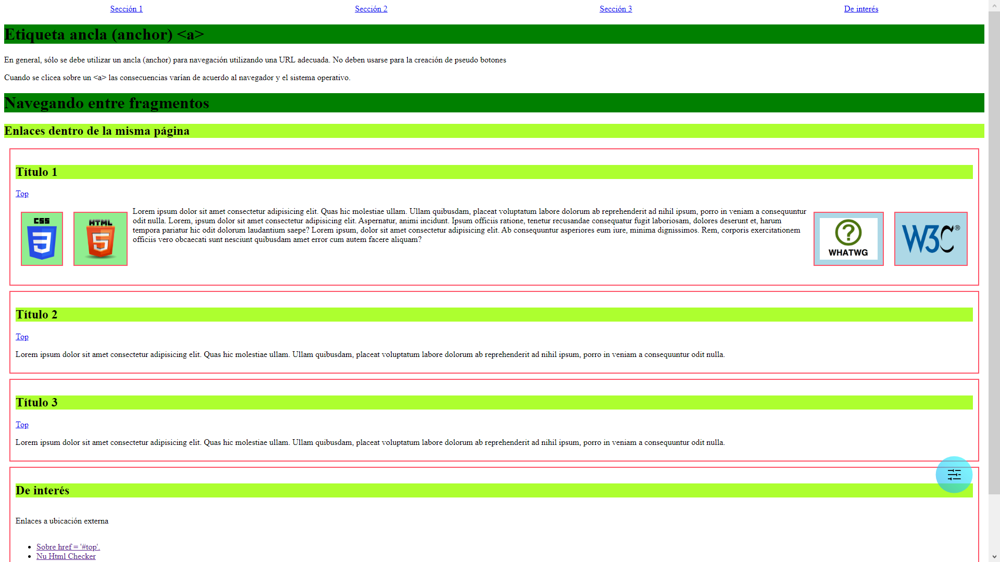

# UD2 A7. Enlaces, imágenes y otros menesteres

Modifica el sitio para que se cumplan las siguientes especificaciones:
- Al principio del sitio aparecen enlaces a cada una de las secciones. Identifícalas como seccion1, seccion2...
- Dichos enlaces están separados de forma equidistante entre ellos
- En cada sección hay un enlace que te lleva al principio de la página. Usa href="#"
- Enlaces de interés navega hacia los enlaces externos indicados
- Sitúa las imágenes con la propiedad     float: right y     float: left
- A cada imagen/sección añádele el borde, padding y margin  
- Ten en cuenta la accesibilidad del sitio
- Comprueba que el sitio es válido según uno de los validadores indicados

  
## [Solución](./Solucion/../../../U03%20CSS/3.6%20UD3%20A4.%20CSS%20Grid.%20Template%20areas/SolucionU03A4.html)  
