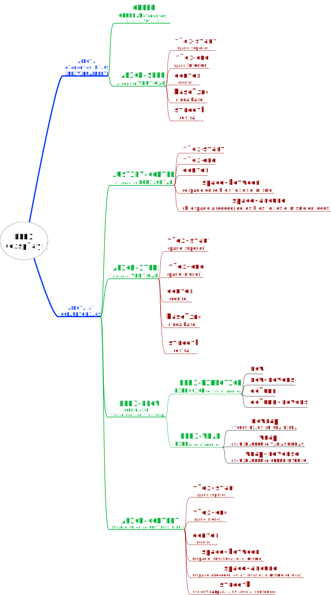

# UD3 A5. CSS flexbox. Flexbox Froggy

Aquí tenéis otro juego CSS. [Flexbox Froggy](https://flexboxfroggy.com/#es) es un juego online en el que se deben completar algunas propiedades CSS o valores relacionados con el posicionamiento FlexBox CSS.  El modelo de caja flexible o flexbox fue diseñado como un modelo unidimensional de layout, y como un método que pueda ayudar a distribuir el espacio entre los ítems de una interfaz y mejorar las capacidades de alineación.

Envía un pantallazo donde se vean todos los niveles completados, así como tu nombre en mayúsculas en el CSS Editor.
  

----
# Soluciones del ejercicio
----
1. **justify-content**:flex-end;
2. **justify-content**: center;
3. **justify-content**: space-around;
4. **justify-content**: space-between;
5. **align-items**:flex-end;
6. **align-items**: center;  
**justify-content**: center;
7. **justify-content**:space-around;  
**align-items**:flex-end;
8. **flex-direction**: row-reverse;
9. **flex-direction**: column;  
**justify-content**: flex-end;  
10. **flex-direction**: row-reverse;  

11. **flex-direction**: column;  
    **justify-content**: flex-end;
12. **flex-direction**: column-reverse;  
     **justify-content**: space-between;
13. **justify-content**: center;  
**flex-direction**: row-reverse;  
**align-items**: flex-end;

14. **order**: 1;
15. **order**:-3;
16. **align-self**:flex-end;
17. **order**:1;  
    **align-self**:flex-end;
18. **flex-wrap**:wrap;
19. **flex-direction**: column;  
    **flex-wrap**: wrap;
20. **flex-flow**: column wrap;
21. **align-content**: flex-start;
22. **align-content**: flex-end;
23. **align-content**: center;  
**flex-direction**: column-reverse;
24. **flex-flow**: wrap-reverse column-reverse;  
   **justify-content**: center;  
**align-content**: space-between;
   
