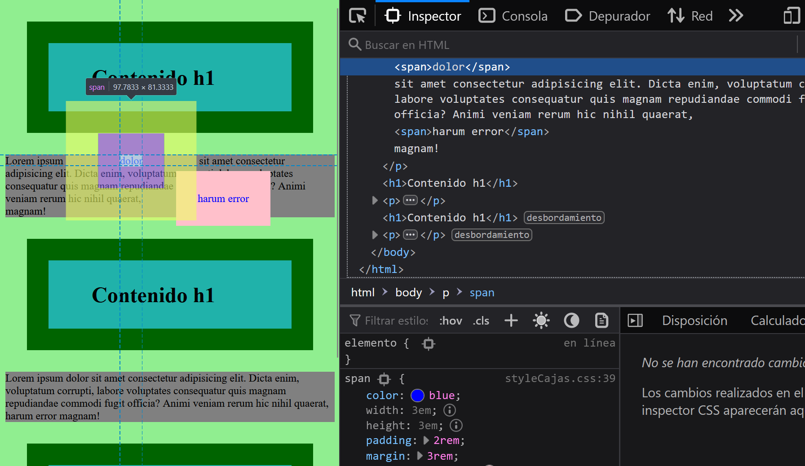
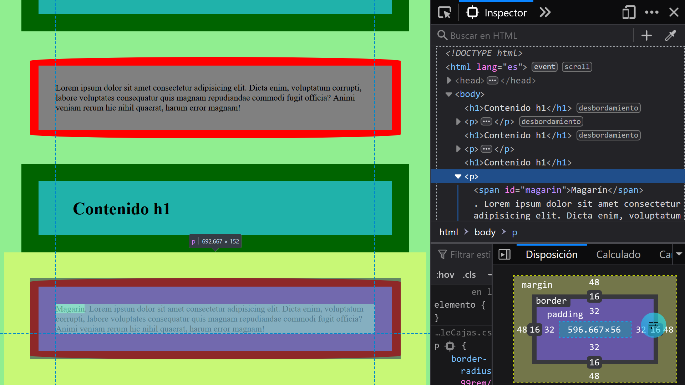

# UD3 A7. El modelo de Caja CSS

Todo en CSS tiene una caja alrededor, y comprender estas cajas es clave para poder crear diseños con CSS o para alinear elementos con otros elementos. 

En CSS, en general, hay dos tipos de cajas: cajas en bloque y cajas en línea (inline). Estas características se refieren al modo como se comporta la caja en términos de flujo de página y en relación con otras cajas de la página. 

- Si una caja se define como un **bloque** &lt;h1&gt;, &lt;p&gt;...
  - la caja fuerza un salto de línea al llegar al final de la línea.
  - La caja se extenderá en la dirección de la línea para llenar todo el espacio disponible que haya en su contenedor. 
  - Se respetan las propiedades width y height.
  - El relleno, el margen y el borde mantienen a los otros elementos alejados de la caja.
- Si una caja tiene una visualización externa de tipo **inline** &lt;a&gt;, &lt;span&gt;...
  - la caja no fuerza ningún salto de línea al llegar al final de la línea.
  - NO SE APLICAN las propiedades width y height 
  - Se aplican relleno, margen y bordes verticales, pero no mantienen alejadas otras cajas en línea.
  - Se aplican relleno, margen y bordes horizontales, y mantienen alejadas otras cajas en línea.

El tipo de caja que se aplica a un elemento está definido por los valores de propiedad display, como block y inline, y se relaciona con el valor externo (outer) de visualización (display).

El modelo de cajas CSS completo se aplica a cajas que presentan comportamiento en bloque; las cajas con comportamiento en línea solo usan una parte del comportamiento definido en el modelo de cajas. El modelo define cómo funcionan juntas las diferentes partes de una caja (margen, borde, relleno y contenido) para crear una caja que puedas ver en tu página. Para complicarlo un poco más, hay un modelo de cajas estándar y un modelo de cajas alternativo que no veremos.

## Partes de una caja
Al hacer una caja de tipo bloque en CSS tenemos los elementos siguientes:

- El contenido de la caja (o content box): El área donde se muestra el contenido, cuyo tamaño puede cambiarse utilizando propiedades como width y height.
- El relleno de la caja (o padding box): El relleno es espacio en blanco alrededor del contenido; es posible controlar su tamaño usando la propiedad padding y otras propiedades relacionadas.
- El borde de la caja (o border box): El borde de la caja envuelve el contenido y el de relleno. Es posible controlar su tamaño y estilo utilizando la propiedad border y otras propiedades relacionadas.
- El margen de la caja (o margin box): El margen es la capa más externa. Envuelve el contenido, el relleno y el borde como espacio en blanco entre la caja y otros elementos. Es posible controlar su tamaño usando la propiedad margin y otras propiedades relacionadas.

Échale un vistazo a los enlaces de interés y realiza los siguientes ejercicios:
1.  [Modelo de caja 1](http://desarrolloweb.dlsi.ua.es/libros/html-css/ejercicio-modelo-caja-1)
2.  [Modelo de caja 2](http://desarrolloweb.dlsi.ua.es/libros/html-css/ejercicio-modelo-caja-2)
3.  Ejemplo cajas de bloque/en línea. Abre el siguiente [ejemplo cajas](ejemplosCajas.html) en el navegador Firefox de Mozilla. En este ejemplo tanto h1 como span tienen su propio
     - width
     - height
     - padding
     - border
     - margin
     - background-color
 
    Abre las herramientas del navegador Firefox de Mozilla e indica
    - Qué propiedades NO se aplican y por qué

    
    - Padding y margin admiten de 1 a 4 valores. Averígualo en las herramientas del navegador y explica por qué
    -  Al último párrafo añádele un span con tu apellido. Debe verser como el de la imagen, 
    sin espacios alrededor y con tus propios colores para que destaque 
    
    Envía un pantallazo como el adjunto firefox-ultimo-parrafo pero con tu apellido

De interés
- 
 https://developer.mozilla.org/es/docs/Learn/CSS/Building_blocks/The_box_model#m%C3%A1rgenes_relleno_y_bordes
- https://developer.mozilla.org/en-US/docs/Web/CSS/border
- https://developer.mozilla.org/en-US/docs/Web/CSS/border-radius
- https://developer.mozilla.org/en-US/docs/Web/CSS/CSS_Box_Model/Introduction_to_the_CSS_box_model
- https://developer.mozilla.org/en-US/docs/Web/CSS/Shorthand_properties#ordering_properties
- https://lupitacode.medium.com/porcentajes-css-5cbb95967989